# ⚙️ CodePipeline with Terraform & DevSecOps using GitHub Actions and Kubernetes Sealed Secrets

This project establishes a robust CI/CD pipeline on AWS using Terraform, enhanced with cutting-edge DevSecOps practices via GitHub Actions. It provisions an end-to-end AWS CodePipeline (Source, Build, Deploy to EC2) and validates infrastructure with Terratest. Further, it integrates GitHub Actions for automated DevSecOps, incorporating security scanning (tfsec for Terraform, Trivy for Docker images) and secure secret management with Kubernetes Sealed Secrets. This ensures a secure, automated, and efficient application delivery workflow, triggered on every code push.

# 🏛️ Project Architecture

```mermaid
flowchart TD
  %% Direction top to bottom
  direction TB

  %% Developer
  subgraph DEV["👨‍💻 Developer"]
    A1["💻 Push Code to GitHub"]
  end

  %% GitHub Actions CI/CD Flow
  subgraph CICD["🔁 CI/CD with GitHub Actions"]
    B1["⚙️ GitHub Actions Workflow"]
    B2["🔍 tfsec - Terraform Security Scan"]
    B3["🔐 Trivy - Docker Image Scan"]
    B4["🔑 Sealed Secrets CLI"]
  end

  %% AWS Infra
  subgraph AWS["☁️ AWS Infrastructure via Terraform"]
    C1["📦 S3 Bucket\n(Artifact Storage)"]
    C2["🏗️ CodeBuild\n(Build & Test)"]
    C3["🚀 CodeDeploy\n(EC2 Deployment)"]
    C4["🔁 CodePipeline\n(CI/CD Orchestrator)"]
    C5["🔐 IAM Roles & Policies"]
  end

  %% Kubernetes Cluster
  subgraph K8S["📦 Kubernetes Cluster"]
    D1["🧩 SealedSecrets Controller"]
    D2["🛠️ Workload using Secrets"]
    D3["☸️ Kubernetes Workloads"]
  end

  %% Flow connections
  A1 --> B1
  B1 --> B2
  B1 --> B3
  B1 --> B4
  B1 --> C4

  C4 --> C1
  C4 --> C2
  C4 --> C3
  C4 --> C5

  B4 --> D1
  D1 --> D2
  C3 --> D3
```




## 🌐 Live Demo

[https://github.com/Ayush-silicon/DevOps-Masters-Project](https://github.com/Ayush-silicon/DevOps-Masters-Project)

## ✨ Features

-   ⚙️ **End-to-end AWS CodePipeline**: Fully provisioned with Terraform (Source, Build, Deploy).
-   🚀 **CI/CD Automation**: Leverages GitHub Actions for seamless workflow orchestration.
-   🔒 **DevSecOps Integration**: Incorporates `tfsec` for Terraform security and `Trivy` for Docker image vulnerability scanning.
-   🔑 **Secure Secret Management**: Utilizes Kubernetes Sealed Secrets for encrypting and managing sensitive data.
-   🧪 **Infrastructure Testing**: Validates Terraform modules and deployed infrastructure using Terratest.
-   ☁️ **Flexible Deployment**: Supports deployment to AWS EC2 instances and Kubernetes clusters.
-   🔐 **IAM & S3**: Configures necessary IAM roles and S3 buckets for artifact storage.

## 💻 Tech Stack

| Category           | Tools / Platforms                                  |
|--------------------|----------------------------------------------------|
| **IaC**            | Terraform, Terratest                               |
| **Cloud**          | AWS (CodePipeline, CodeBuild, CodeDeploy, S3, IAM) |
| **DevSecOps**      | tfsec, Trivy                                       |
| **Secret Management** | Sealed Secrets (Bitnami)                        |
| **CI/CD**          | GitHub Actions                                     |
| **Containers**     | Docker, Kubernetes                                 |
| **Languages**      | Go (Terratest), YAML                               |

## ⚙️ Installation

To set up and run this project, follow these steps:

1.  **Clone the Repository**

    ```bash
    git clone https://github.com/yourusername/DevOps-Masters-Project.git
    cd DevOps-Masters-Project
    ```

2.  **Configure AWS CLI**

    ```bash
    aws configure
    # Follow prompts to enter your AWS Access Key ID, Secret Access Key, Region, and output format.
    ```

3.  **Install Terraform**

    Ensure you have Terraform (v1.3+ recommended) installed on your system. Refer to the [official Terraform documentation](https://developer.hashicorp.com/terraform/downloads) for installation instructions.

4.  **Configure `terraform.tfvars`**

    Create a file named `terraform.tfvars` in the root of the cloned repository and add your project-specific configurations.

    ```hcl
    project_name       = "myApp"
    bucket_name        = "your-unique-artifact-bucket-name"
    aws_region         = "your-aws-region"
    ami_id             = "ami-xxxxxxxxxxxxxxxxx"        # e.g., ami-0abcdef1234567890 (Ubuntu, Amazon Linux 2, etc.)
    instance_type      = "t3.micro"
    key_name           = "your-keypair-name"            # Must exist in your AWS account
    github_owner       = "your-github-username"
    github_repo        = "your-application-repo"        # The repository containing your app code
    github_branch      = "your-branch-name"
    github_token       = "your-github-personal-access-token" # Token with 'repo' access
    instance_tag_key   = "Name"
    instance_tag_value = "MyAppServer"
    ```

    ⚠️ **Warning:** Never commit `terraform.tfvars` to GitHub as it may contain sensitive information like your GitHub token.

5.  **Provision AWS Infrastructure with Terraform**

    ```bash
    terraform init
    terraform plan
    terraform apply --auto-approve
    ```

### Environment Variables

_Ensure all necessary environment variables (e.g., AWS credentials, GitHub tokens) are securely configured in your CI/CD environment or local setup._

## 🚀 Usage / How it Works

This project is divided into two main tasks: provisioning an AWS CodePipeline with Terraform and enhancing it with DevSecOps practices using GitHub Actions and Kubernetes Sealed Secrets.

### Task 1: AWS CodePipeline using Terraform

This task focuses on provisioning a CI/CD pipeline using AWS CodePipeline, CodeBuild, and CodeDeploy with Terraform. It sets up an automated deployment from GitHub to an EC2 instance, with infrastructure validation using Terratest.

#### 📌 Task Objectives

-   Use Terraform to provision AWS CodePipeline with Source (GitHub), Build (AWS CodeBuild), and Deploy (AWS CodeDeploy to EC2) stages.
-   Define infrastructure as code for CodePipeline, CodeBuild, CodeDeploy, IAM roles/policies, and an S3 artifact bucket.
-   Write infrastructure tests using [Terratest](https://terratest.gruntwork.io/) to validate Terraform modules.
-   Apply Terraform and verify a successful deployment.

#### 📦 Prerequisites for Application Deployment

Your application repository must contain:
-   ✅ [`buildspec.yml`](examples/buildspec.yml): Defines the build and artifact steps for AWS CodeBuild.
-   ✅ [`appspec.yml`](examples/appspec.yml): Required by AWS CodeDeploy for EC2 deployments.
-   ✅ [`scripts/install.sh`](examples/scripts/install.sh): Script to install dependencies on the EC2 instance.
-   ✅ [`scripts/start.sh`](examples/scripts/start.sh): Script to start your application (e.g., a React app).

You can copy these example files from the `examples/` folder in this repository or refer to a working example application repository.

#### 🧪 Infrastructure Testing with Terratest

To validate the Terraform modules using Terratest:

1.  **Install Prerequisites**: Ensure you have Go (for Terratest), Terraform, and Git installed.
2.  **Project Structure**: Organize your project like this:
    ```
    DevOps-Masters-Project/
    ├── terraform/                     # Your Terraform code (main.tf, variables.tf, etc)
    └── test/                          # Terratest files
        └── terraform_pipeline_test.go
    ```
3.  **Write the Test Code**: Create `test/terraform_pipeline_test.go`
    ```go
    package test

    import (
      "testing"

      "github.com/gruntwork-io/terratest/modules/terraform"
      "github.com/stretchr/testify/assert"
    )

    func TestTerraformPipeline(t *testing.T) {
      t.Parallel()

      tf := &terraform.Options{
        TerraformDir: "../terraform", // Adjust path as per your directory
      }

      defer terraform.Destroy(t, tf)             // Cleanup resources after test
      terraform.InitAndApply(t, tf)             // Run terraform init + apply

      pipelineName := terraform.Output(t, tf, "codepipeline_name") // Replace with actual output variable name
      assert.NotEmpty(t, pipelineName)
    }
    ```
4.  **Ensure Terraform Output Is Defined**: In your `terraform/output.tf` (or `main.tf`), include an output for the pipeline name:
    ```hcl
    output "codepipeline_name" {
      value = aws_codepipeline.my_pipeline.name # Update "my_pipeline" with your actual resource name.
    }
    ```
5.  **Initialize Go Project**: From the `DevOps-Masters-Project` root:
    ```bash
    go mod init devops-masters-test
    go get github.com/gruntwork-io/terratest/modules/terraform
    go get github.com/stretchr/testify/assert
    ```
6.  **Run the Test**: From the root directory:
    ```bash
    go test ./test
    ```
    This will initialize and apply your Terraform, capture and assert outputs, and automatically destroy resources.
    
## 📸 Screenshots


## 🧠 Common Problems & Fixes

| Problem                                    | Fix                                                                            |
|-------------------------------------------|---------------------------------------------------------------------------------|
| ❌ `HEALTH_CONSTRAINTS` error in CodeDeploy | Ensure your EC2 IAM role has `s3:GetObject` permissions on the artifact bucket |
| ❌ EC2 agent not running                    | Check if `codedeploy-agent` is running (see `user_data` script in `main.tf`)   |
| ❌ Pipeline fails at source                 | Verify GitHub repo, branch name, and token permissions                         |
| ❌ Build fails                              | Check `buildspec.yml` and make sure it's valid and points to correct scripts   |

### Task 2: DevSecOps Integration using GitHub Actions and Sealed Secrets

This task integrates advanced DevSecOps practices into the CI/CD pipeline using GitHub Actions for automated security scanning and Kubernetes Sealed Secrets for secure secret management.

1.  **Setup GitHub Actions Workflow**

    Create the GitHub Actions workflow file: `.github/workflows/devsecops-pipeline.yml`

    ```yaml
    name: DevSecOps CI/CD

    on:
      push:
        branches:
          - main

    jobs:
      validate-terraform:
        name: Terraform Validation & tfsec
        runs-on: ubuntu-latest
        steps:
          - name: Checkout repository
            uses: actions/checkout@v3

          - name: Setup Terraform
            uses: hashicorp/setup-terraform@v2
            with:
              terraform_version: 1.5.5

          - name: Terraform Init
            run: terraform init

          - name: Terraform Format
            run: terraform fmt -check

          - name: Terraform Validate
            run: terraform validate

          - name: Run tfsec (Terraform security scan)
            uses: aquasecurity/tfsec-action@v1.0.0
    ```

2.  **Add Docker Image Build + Trivy Scan**

    Extend the same workflow (`.github/workflows/devsecops-pipeline.yml`) with a job for Docker build and Trivy scanning:

    ```yaml
      docker-security:
        name: Docker Build & Trivy Scan
        runs-on: ubuntu-latest
        needs: validate-terraform
        steps:
          - name: Checkout repository
            uses: actions/checkout@v3

          - name: Set up Docker Buildx
            uses: docker/setup-buildx-action@v2

          - name: Build Docker image
            run: docker build -t myapp:latest .

          - name: Install Trivy
            run: |
              sudo apt-get install wget apt-transport-https gnupg lsb-release -y
              wget -qO - https://aquasecurity.github.io/trivy-repo/deb/public.key | sudo apt-key add -
              echo deb https://aquasecurity.github.io/trivy-repo/deb stable main | sudo tee -a /etc/apt/sources.list.d/trivy.list
              sudo apt-get update
              sudo apt-get install trivy -y

          - name: Scan image with Trivy
            run: trivy image --exit-code 1 --severity CRITICAL,HIGH myapp:latest
    ```

3.  **Encrypt Kubernetes Secrets using Sealed Secrets**

    a.  **Install `kubeseal` CLI**:
        ```bash
        choco install kubeseal  # Windows
        brew install kubeseal   # macOS
        ```
    b.  **Generate a Kubernetes Secret**:
        ```bash
        kubectl create secret generic db-creds --from-literal=username=admin --from-literal=password=pass123 --dry-run=client -o yaml > secret.yaml
        ```
    c.  **Encrypt using `kubeseal`**: You need the Sealed Secrets controller certificate from your Kubernetes cluster (e.g., `my-sealed-secrets-cert.pem`).
        ```bash
        kubeseal --cert my-sealed-secrets-cert.pem -o yaml < secret.yaml > sealed-secret.yaml
        ```
    d.  **Store `sealed-secret.yaml`**: Place this file in a folder like `k8s/secrets/` in your GitHub repository.

    **Sample `sealed-secret.yaml` (for Kubernetes)**
    ```yaml
    apiVersion: bitnami.com/v1alpha1
    kind: SealedSecret
    metadata:
      name: db-creds
      namespace: default
    spec:
      encryptedData:
        password: AgB0c34xX2... # Your encrypted password
        username: AgD1Ukw... # Your encrypted username
      template:
        metadata:
          name: db-creds
          namespace: default
    ```
    📌 Save this in your repo at: `k8s/secrets/sealed-secret.yaml`

    **Sample `deployment.yaml` for Kubernetes**
    This demonstrates how your application deployment can consume the secrets.
    ```yaml
    apiVersion: apps/v1
    kind: Deployment
    metadata:
      name: myapp
      labels:
        app: myapp
    spec:
      replicas: 1
      selector:
        matchLabels:
          app: myapp
      template:
        metadata:
          labels:
            app: myapp
        spec:
          containers:
            - name: myapp
              image: myapp:latest # Replace with your actual image
              ports:
                - containerPort: 3000
              env:
                - name: DB_USERNAME
                  valueFrom:
                    secretKeyRef:
                      name: db-creds
                      key: username
                - name: DB_PASSWORD
                  valueFrom:
                    secretKeyRef:
                      name: db-creds
                      key: password
    ```
    📌 Save this as: `k8s/manifests/deployment.yaml`

4.  **Deploy to Kubernetes in Workflow**

    Add the final deployment job to your GitHub Actions workflow:

    ```yaml
      deploy-kubernetes:
        name: Deploy to Kubernetes
        runs-on: ubuntu-latest
        needs: docker-security
        steps:
          - name: Checkout code
            uses: actions/checkout@v3

          - name: Setup kubectl
            uses: azure/setup-kubectl@v3
            with:
              version: v1.29.0

          - name: Configure Kubeconfig
            run: |
              mkdir -p ~/.kube
              echo "${{ secrets.KUBECONFIG_BASE64 }}" | base64 -d > ~/.kube/config

          - name: Apply Sealed Secret
            run: kubectl apply -f k8s/secrets/sealed-secret.yaml

          - name: Deploy app manifests
            run: kubectl apply -f k8s/manifests/
    ```

    **NOTE:** Store your `kubeconfig` securely as a GitHub secret (e.g., `KUBECONFIG_BASE64`), base64 encoded.

#### 🧪 Final Test Flow (When You Push Code)

Upon a code push to the `main` branch, the GitHub Actions workflow will execute:

1.  Terraform configuration is validated and scanned with `tfsec`.
2.  A Docker image is built and scanned for vulnerabilities with `Trivy`.
3.  Sealed secrets are applied to the Kubernetes cluster, securely provisioning sensitive data.
4.  The application is deployed to Kubernetes, utilizing those decrypted secrets.

## 📁 Folder Structure

```
DevOps-Masters-Project/
├── .github/workflows/
│   └── devsecops-pipeline.yml
├── terraform/
│   ├── main.tf
│   ├── variables.tf
│   └── outputs.tf
├── docker/
│   └── Dockerfile
├── k8s/
│   ├── manifests/
│   │   └── deployment.yaml
│   └── secrets/
│       └── sealed-secret.yaml
├── examples/ # Contains buildspec.yml, appspec.yml, scripts for application
├── test/     # Terratest files
│   └── terraform_pipeline_test.go
├── .gitignore
├── README.md
├── main.tf   # Or other Terraform config files
└── terraform.tfvars.example # Template for tfvars
```

## 👋 Contributions

We welcome contributions! Please follow these steps to contribute:

1.  Fork the repository
2.  Clone your fork: `git clone https://github.com/your-username/DevOps-Masters-Project.git`
3.  Create a new branch: `git checkout -b feature/your-feature-name`
4.  Make your changes and commit them: `git commit -m "feat: Add your feature"`
5.  Push to your branch: `git push origin feature/your-feature-name`
6.  Submit a pull request explaining your changes.

## 💡 Upcoming Features

-   🎯 Integration with advanced monitoring tools (e.g., Prometheus, Grafana).
-   🛡️ Enhanced security scanning with DAST/SAST tools.
-   🔄 Automated rollback strategies for failed deployments.
-   📊 Dashboard for CI/CD pipeline health and metrics.
-   ☁️ Multi-cloud deployment options.

## 📜 License

This project is licensed under the MIT License - see the LICENSE file for details.

## 📧 Contact

**Author Name:** Ayush Singh

**Email:**  singh.ayush.kv@gmail.com

